# Pitcher Anomaly Detection with Statcast Data

**Video Presentation:** [[Presentation](https://www.youtube.com/watch?v=rqN7egnuWlw)]

---

## Project Overview

We are building a model that, given a single pitch based on Statcast features and context, predicts which pitcher threw it. This will be done for all pitchers with a sufficient number of innings pitched in the MLB. The model learns the distinctive characteristics of each pitcher's repertoire based on pitching metrics (release point, spin rate, movement) as well as game context (current count, position of runners, score differential).

**Use Case:** This model serves as an advanced scouting tool. By feeding pitches from another pitcher's starts into the model, we can analyze which pitcher profiles they most closely resemble and how they compare to different pitching styles. This provides insights into pitch characteristics, helps identify similar pitchers for comparative analysis, and reveals unique aspects of a pitcher's approach that distinguish them from others.

---

## Objectives

1. **Goal 1:** Given pitch characteristics and game context, predict which pitcher threw the pitch.
2. **Goal 2:** Use prediction probabilities and misclassifications to identify similar pitchers and compare pitching styles for scouting analysis.

### How We Achieved These Goals

**Goal 1 - Pitcher Classification:**
We trained a Multi-Layer Perceptron (MLP) neural network on 293,185 pitches from 110 qualified MLB pitchers. The model achieved 83% top-1 accuracy and 96% top-3 accuracy. The key to success was careful feature engineering, particularly normalizing handedness to prevent the model from using left vs right as a shortcut instead of learning pitcher-specific characteristics.

**Goal 2 - Similarity Analysis:**
Rather than just averaging pitch features, we leveraged the trained classifier's confusion patterns. When the model consistently confuses pitcher A for pitcher B, it reveals they have similar pitch profiles. We developed a confusion-based similarity metric that normalizes by each pitcher's total confusion mass, creating comparable scores even between highly distinctive and generic pitchers. This approach captures which pitchers the model actually struggles to distinguish in practice, revealing similarities that simple feature averaging would miss. 

---

## Quick Start with Makefile

To set up and run the project quickly, we provide a Makefile with all dependencies:

### Installation
```bash
# Install all dependencies
make install
```

---

## Data Collection

We gathered data from MLB Statcast using the pybaseball library for the 2025 season. The dataset includes comprehensive information for each pitch thrown:

**Kinematic Features:**
- Release speed, position (x, y, z), and extension
- Spin rate and spin axis
- Pitch movement (pfx_x, pfx_z)
- Velocity components (vx0, vy0, vz0)
- Acceleration components (ax, ay, az)
- Plate location (plate_x, plate_z)

**Contextual Features:**
- Pitch type
- Ball-strike count
- Pitcher handedness (p_throws)
- Batter handedness (stand)
- Player name

All available features are documented at https://baseballsavant.mlb.com/csv-docs.

---

## Data Processing

### Categorical Feature Encoding

To perform classification, we converted categorical features into binary features:

**Pitch Type Encoding:**
- The pitch_type field contains encodings such as "FF" (four-seam fastball) or "CH" (changeup)
- We created a separate binary feature for each pitch type
- Pitches with less than 1000 total pitches thrown were binned into an "other" category and deemed rare pitches. Pitches in the bin:
- Each pitch now has a 1 in its corresponding pitch type column and 0 in all others

**Ball-Strike Count Encoding:**
- Rather than treating balls and strikes as scaled numerical values, we recognized that each count has distinct strategic implications
- We created binary features for each possible count (e.g., count_0-0, count_1-2, count_3-2)
- This allows the model to learn the unique characteristics of pitches thrown in different counts
- Had to filter out invalid, possible error counts (like 4-2, 1-3)

**Handedness Encoding:**
- p_throws and stand represent pitcher and batter handedness (L or R)
- Created a single binary matchup feature: 1 if batter and pitcher have opposite handedness, 0 if same
- This captures strategic matchup information without revealing individual handedness

**Critical Handedness Normalization:**
To prevent the model from learning handedness as a shortcut, we transformed left-handed pitcher features to align with right-handed convention:
- `release_pos_x` multiplied by -1 for LHP (mirrors horizontal release position)
- `pfx_x` multiplied by -1 for LHP (mirrors horizontal pitch movement)
- `spin_axis` adjusted using formula: `(180 - spin_axis) % 360` for LHP (normalizes spin axis angles)

After these transformations, the p_throws column was dropped so the model has no access to handedness information.

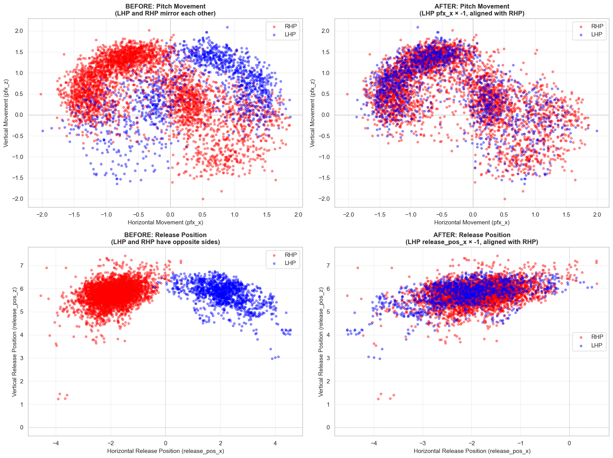
*Before and After: Pitch movement and release position for LHP vs RHP. After transformation, left-handed pitchers align with right-handed convention, preventing the model from using handedness as a shortcut.*

Overall, dealing with handedness was the biggest challenge in the data processing/feature extraction phase.

### Data Filtering

We filtered the dataset to focus on qualified major league starting pitchers:
- Applied a minimum pitch count threshold of 2,000 pitches per pitcher
- This filtering removed relief pitchers, who are deployed in different roles and situations
- Final dataset includes 110 pitchers
- This prevents the model from learning role-specific patterns rather than pitcher-specific characteristics

### Feature Scaling

All numerical features were normalized using StandardScaler to ensure they are on comparable ranges for the neural network.

---

## Preliminary Visualizations

Before we attempted any modeling, we had to get familiar with the data. We created several visualizations to understand the data:

### Release Point Analysis

Scatter plot of release_pos_x vs release_pos_z showing distinct clusters for left-handed and right-handed pitchers:

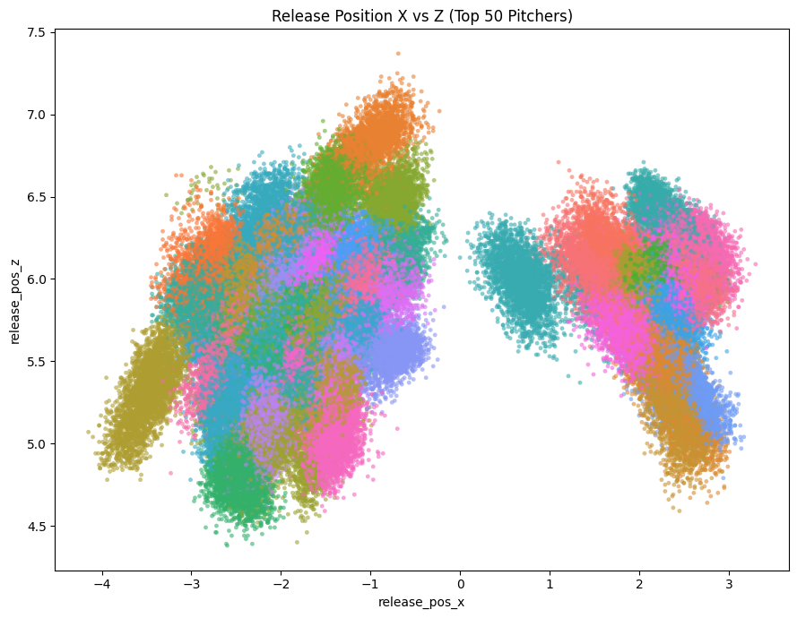

Individual pitcher release point plots colored by pitch type, revealing consistency and variation patterns:

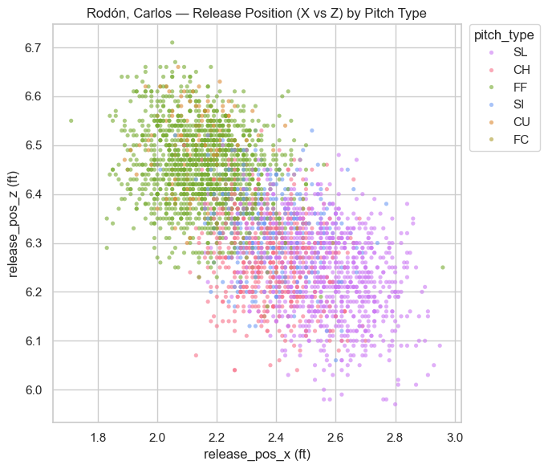

### Pitch Distribution

Histogram of total pitches thrown by each pitcher, showing the distribution across all MLB pitchers. This was used to determine appropriate minimum pitch count threshold:

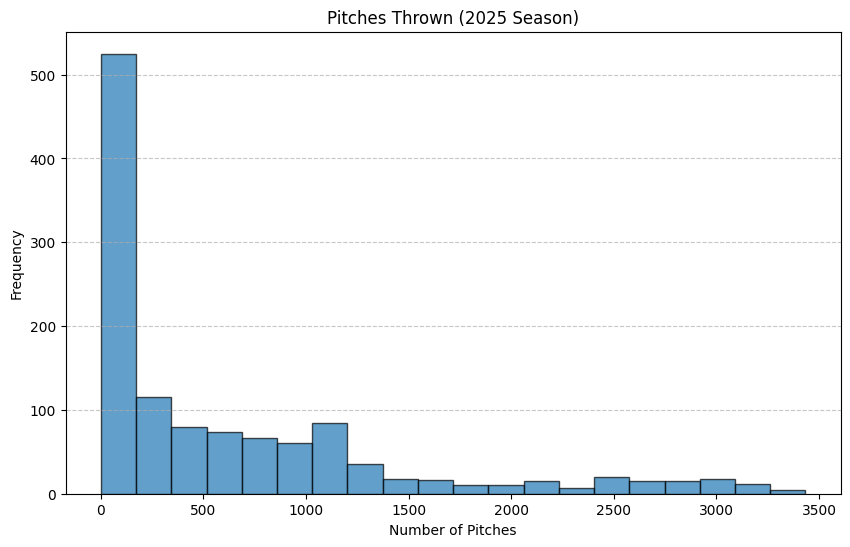

### Feature Correlation Matrices

Initial correlation matrix showed confounding effects of mixing left-handed and right-handed pitchers. Separate correlation matrices by handedness revealed clearer relationships between features, with notable correlations between release_speed and plate_z, and spin_rate with spin_axis within handedness groups:

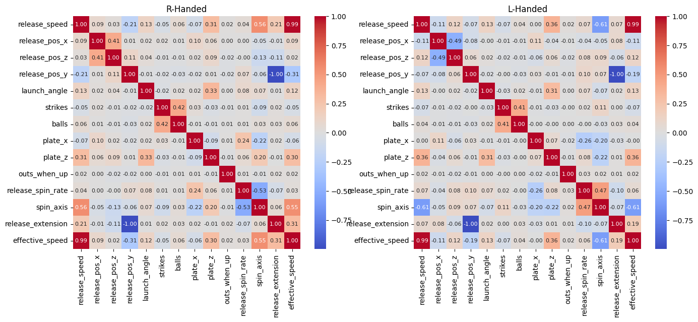

At this point, we realized handedness was a cumbersome feature that we needed to account for.

### Pitcher Similarity Visualizations

Averaging out a pitcher's ground truth pitches into a single vector using the same features the model will train on, we compared the euclidean distances and cosine distances of these 'characteristic vectors' to determine which pitchers threw similarly to one another beforehand.

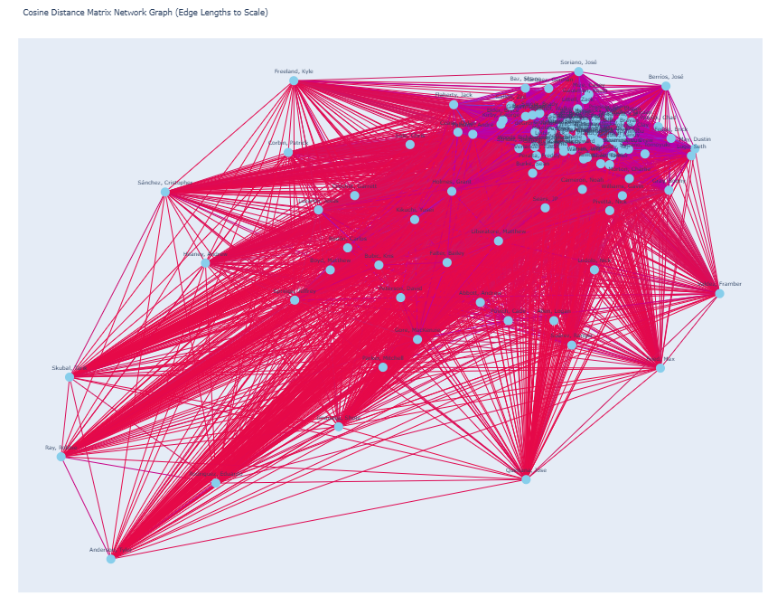

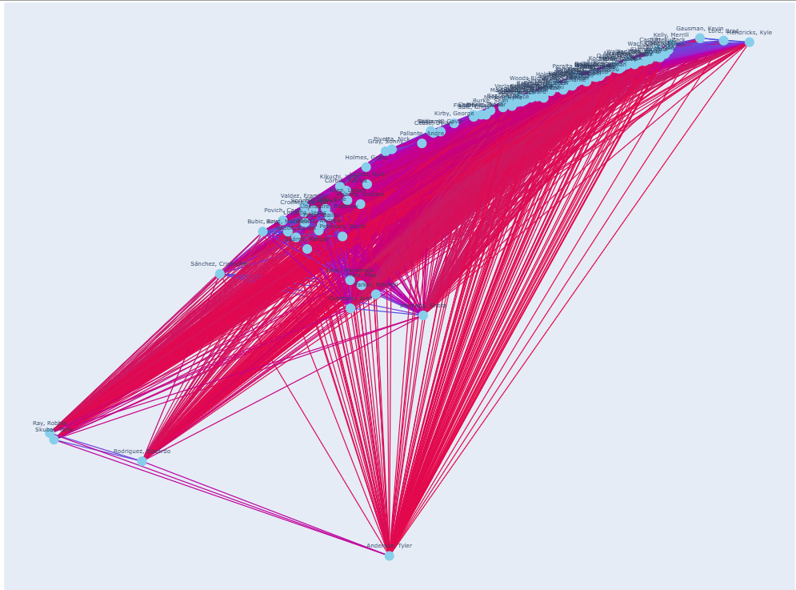
*Difficult to interpret here, but within MLP_feature_cleaning.ipynb you can interact with the image.*

---

## Data Modeling Methods

### Model Selection

We considered several classification architectures before settling on the Multi-Layer Perceptron (MLP):

**Models Considered:**
- **Logistic Regression:** Baseline linear model - struggles with the non-linear relationships between pitch features
- **Random Forest:** Ensemble tree-based model - lacksthe ability to capture complex feature interactions as effectively as neural networks
- **Multi-Layer Perceptron (MLP):** Selected for final implementation due to superior performance in capturing non-linear patterns and pitcher-specific signatures

**Why MLP?**
- Ability to learn complex, non-linear relationships between pitch characteristics
- Flexibility in architecture allows optimization for this specific task
- Strong performance on multi-class classification problems with overlapping classes
- Can effectively leverage the high-dimensional feature space created by one-hot encoding

### Hyperparameter Tuning

We conducted systematic hyperparameter optimization using Optuna, a state-of-the-art framework for automated hyperparameter search:

**Parameters Tuned:**
- **Hidden Layer 1 Size:** Tested [64, 128, 192, 250] neurons
  - Final: 250 neurons
- **Hidden Layer 2 Size:** Tested [32, 64, 128, 192, 250] neurons (constrained to ≤ hidden1)
  - Final: 192 neurons
- **Dropout Rate:** Range [0.1, 0.5]
  - Final: 0.273
- **Learning Rate:** Log-scale range [0.0001, 0.01]
  - Final: 0.00099
- **Weight Decay:** Log-scale range [0.000001, 0.001]
  - Final: 0.0000102
- **Batch Size:** Tested [32, 64, 128]
  - Final: 64

**Tuning Process:**
- Used Optuna's Tree-structured Parzen Estimator (TPE) sampler for intelligent search
- Optimized for validation F1 score (macro-averaged)
- Applied architectural constraint: hidden2 ≤ hidden1 to prevent overfitting
- Applied early stopping (patience=3 epochs) during trial training
- Trained each trial for up to 20 epochs
- Monitored for overfitting by tracking training vs validation loss gap
- Selected configuration that achieved best validation F1 score: 0.854

**Saved Artifacts:**
- Optimal hyperparameters saved to `outputs/best_hyperparameters.json` for reproducibility
- Model can be retrained with saved parameters without re-running expensive Optuna search
- Training script automatically loads saved hyperparameters if available

### Model Architecture

We implemented a Multi-Layer Perceptron (MLP) neural network for pitcher classification using PyTorch:

**Network Structure (Optimized):**
- Input layer: 32 features (after one-hot encoding and feature engineering)
- Hidden layer 1: 250 neurons with ReLU activation
- Dropout: 0.273 rate after first hidden layer
- Hidden layer 2: 192 neurons with ReLU activation  
- Dropout: 0.273 rate after second hidden layer
- Output layer: 110 neurons (one per pitcher) with softmax activation

**Training Configuration:**
- Loss function: Cross-entropy loss
- Optimizer: Adam with learning rate of 0.00099 and weight decay of 0.0000102
- Batch size: 64
- Training epochs: Up to 100 with early stopping (patience=10)
- Data split: 80% training, 20% validation (stratified by pitcher)
- Final model: Trained for 85 epochs before early stopping

**Implementation Details:**
- Used PyTorch framework for neural network implementation
- Applied StandardScaler normalization to all numerical features
- Implemented early stopping to prevent overfitting
- Tracked multiple metrics: training loss, validation loss, validation accuracy, and macro F1 score
- Model state saved at best validation F1 score
- All training artifacts saved to `outputs/` directory for reproducibility

---

## Results

### Classification Performance

The neural network achieved strong performance in pitcher identification:

**Overall Accuracy Metrics:**
- Top-1 Accuracy (Exact Match): 85.70%
- Top-3 Accuracy: 97.36%
- Top-5 Accuracy: 99.09%

These results indicate that the model correctly identifies the pitcher on the first guess 86% of the time, and includes the correct pitcher in the top 3 predictions 97% of the time.

### Per-Pitcher Analysis

Performance varied significantly across individual pitchers, revealing which pitchers have truly distinctive signatures:

**Per-Pitcher Accuracy Statistics:**
- Mean: 85.34%
- Median: 87.46%
- Standard Deviation: 10.91%

**Most Distinctive Pitchers (Near-Perfect Accuracy):**
- Nick Lodolo: 100.0% (510/510 pitches)
- JP Sears: 100.0% (500/500 pitches)
- Kyle Hendricks: 99.8% (514/515 pitches)
- Justin Verlander: 99.6% (535/537 pitches)
- Freddy Peralta: 99.4% (613/617 pitches)

**Least Distinctive Pitchers (Frequently Confused):**
- Randy Vásquez: 52.3% (225/430 pitches)
- Davis Martin: 55.0% (260/473 pitches)
- Shane Smith: 56.2% (267/475 pitches)
- Antonio Senzatela: 58.9% (289/491 pitches)
- Luis Severino: 59.9% (327/546 pitches)

This wide range (52%-100%) shows that some pitchers have highly unique signatures that the model learns easily, while others have more generic characteristics that overlap with many other pitchers. The model's confusion patterns reveal real similarities in pitching styles that would be difficult to detect through simple statistical averaging.

---

### Feature Importance Analysis (SHAP)

We were able to use the SHAP toolkit to generate feature importance values from our model.
**This allowed us to learn:**
- Features with positive impact that the model relied on the most
- Features with negative impact that confused the model
- Net effect per feature
- Balance of net-positive versus net-negative features

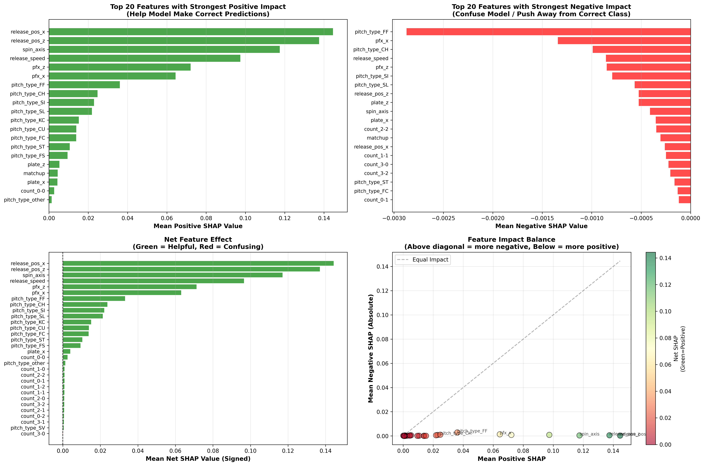
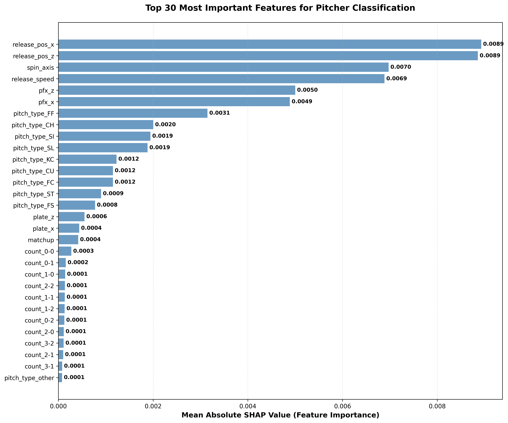

**Noteworthy Positive Features (our model learned the most from):**
- Release Position X and Z
- Spin Axis
- Release Speed

**Noteworthy Negative Features (our model confused pitchers on these):**
- Pitch Type for Changeup and Four-seam Fastball
- PFX X
- Release Speed
- Pitch Counts (there are a lot of binary features for each pitch count)
 
Release speed is both part of positive and negative as it depends on which pitcher specifically it's negatively or positively associated with.
We had a higher proportion of negative than positive features (mostly due to the pitch count features); we could definitely drop these features as they're likely just noise the model doesn't need to focus on.

---

### Training Dynamics

Analysis of training and validation loss curves revealed:
- Both losses decreased steadily over epochs
- Validation loss tracked training loss closely, indicating minimal overfitting
- The model converged within 50 epochs

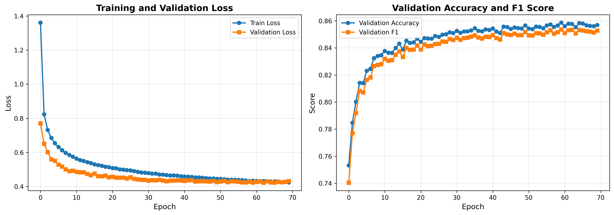

---

## Confusion-Based Similarity Implementation

After achieving strong classification performance, we implemented our confusion-based similarity approach to identify which pitchers the model finds most similar.

### How It Works

The key insight is that the model's confusion patterns reveal meaningful similarities. When the model consistently misclassifies pitcher A's pitches as pitcher B, it suggests they have similar pitch characteristics.

**Step 1: Build the Confusion Mass Matrix**
- Run all validation pitches through the trained model
- For each pitcher i, accumulate the softmax probability mass assigned to each other pitcher j
- This creates a matrix C where C[i,j] represents the total probability mass from pitcher i confused as pitcher j
- Zero out the diagonal (we don't care about self-classification for similarity)

**Step 2: Compute Off-Diagonal Confusion Mass**
- For each pitcher i, calculate m[i] = sum of all confusion masses (how confusable they are overall)
- Pitchers with high m[i] are frequently misclassified (generic/overlapping styles)
- Pitchers with low m[i] are rarely misclassified (unique/distinctive styles)

**Step 3: Calculate Weighted Symmetric Similarity**

We use the formula:

$$\text{Sim}[i,j] = \frac{C[i,j] + C[j,i]}{m[i] + m[j]}$$

This normalizes by the total confusion masses of both pitchers, making similarities comparable even when pitchers have very different distinctiveness levels. It's symmetric by construction (Sim[i,j] = Sim[j,i]).

**Why This Approach?**
- It captures what the model actually learned, not just geometric distance in feature space
- Normalizing by confusion mass prevents rare confusions from dominating the similarity scores
- If A and B have a similar pitch and not much else, this will be reflected by the mass, when it would be hidden by an aggregate comparison.
- It emphasizes systematic patterns among frequently confused pitchers
- Unlike common player similarities, it works across handedness because our feature processing hid this attribute to the model during training training

### Saved Output Files

We save all the computed matrices to the `outputs/` directory:
- `confusion_mass_matrix.npy` - The full C matrix (110 x 110)
- `off_diagonal_mass.npy` - Total confusion per pitcher m (110,)
- `similarity_matrix_weighted_symmetric.npy` - Final similarity scores Sim (110 x 110)
- `pitcher_uniqueness.npy` - Self-classification accuracy per pitcher (110,)
- `pitcher_names.npy` - Pitcher name mapping (110,)

### Example Results

**Top Pitcher Confusions (Directional):**
These show which pitchers get confused for each other most often. The asymmetry reveals interesting patterns - for example, pitcher A might often be confused as B, but not vice versa.


*Heatmap showing the highest confusion masses between pitcher pairs*

**Top Symmetric Similarities:**
These are the pitcher pairs with the highest weighted symmetric similarity scores, representing the most comparable pitch profiles according to the model.

[Add table or visualization showing top 20 most similar pitcher pairs]

---

## Interactive Dashboard

We built a Streamlit dashboard (`dashboard.py`):

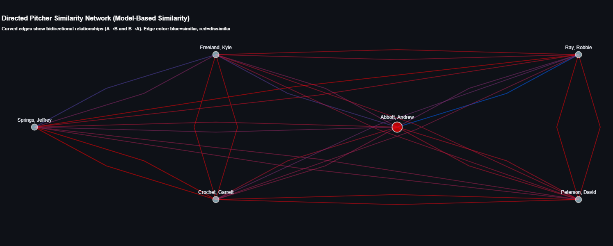

**Features:**
- Select any pitcher and view their most similar matches using confusion-based similarity
- Filter by pitch type (FF, SL, CH, etc.) or count (0-0, 3-2, etc.) for context-specific analysis
- Compare confusion-based similarity vs Euclidean distance similarity side-by-side
- Visualize pitcher relationships with interactive network graphs
- Input custom pitch characteristics and see which pitchers would most likely throw it
- View radar charts comparing pitch characteristics across similar pitchers

**To run:**
```bash
streamlit run dashboard.py
```

---

## Future Work

### Extend to Multiple Seasons

Currently trained on 2025 season data. Training on multiple years would:
- Increase data per pitcher for more reliable similarity scores
- Allow tracking how pitcher styles evolve over time
- Enable comparison of current pitchers to historical pitchers

### Pitch-Level Anomaly Detection

Use the model to flag individual pitches that are outliers for a given pitcher:
- Identify pitches with unusually low probability for their true pitcher
- Potentially detect injuries, fatigue, or change in approach

### Alternative Similarity Approaches

Explore other methods for measuring pitcher similarity:
- Attention-based similarity using model internals
- Clustering in the hidden layer representation space
- Compare confusion-based similarity to other approaches systematically

---

## Repository Contents

**Notebooks:**
- `feature_exploration.ipynb`: Data visualization, correlation analysis, and handedness correction exploration
- `MLP_feature_cleaning.ipynb`: Complete pipeline - feature engineering, model training, and confusion-based similarity computation

**Code:**
- `dashboard.py`: Interactive Streamlit dashboard for pitcher similarity analysis and predictions
- `shap_baseball_toolkit.py`: SHAP analysis utilities for model interpretability

**Results:**
- `accuracies.txt`: Per-pitcher classification accuracy results
- `images/`: Visualizations used in this report

**Generated Files:**
- `model.pt`: Trained PyTorch model weights
- `scaler.pkl`: StandardScaler for feature normalization
- `label_encoder.pkl`: LabelEncoder for pitcher name mapping
- `processed_data.csv`: Cleaned and processed pitch data
- `outputs/confusion_mass_matrix.npy`: Directional confusion mass matrix C
- `outputs/similarity_matrix_weighted_symmetric.npy`: Weighted symmetric similarity Sim
- `outputs/pitcher_uniqueness.npy`: Self-classification accuracy per pitcher
- `outputs/pitcher_names.npy`: Pitcher name array
- `statcast_all_cols_2025.csv`: Raw Statcast data (download via pybaseball)
